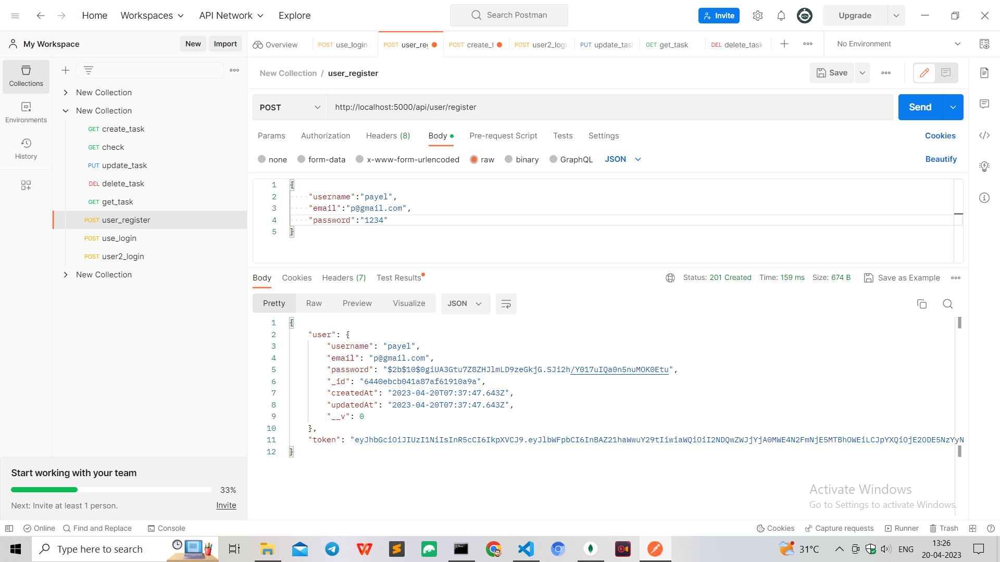
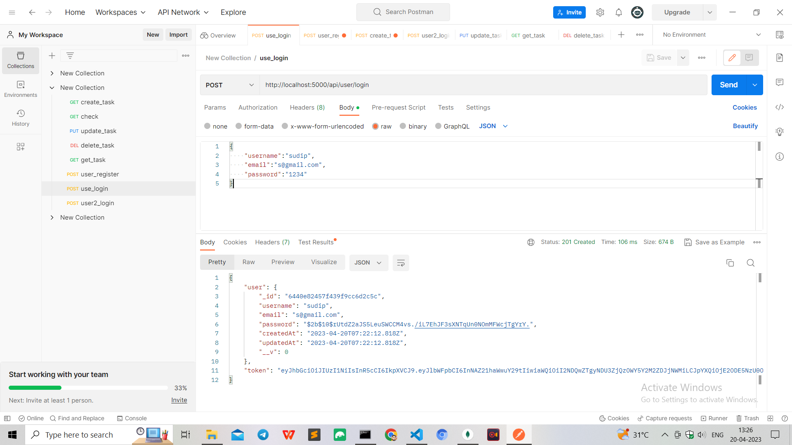
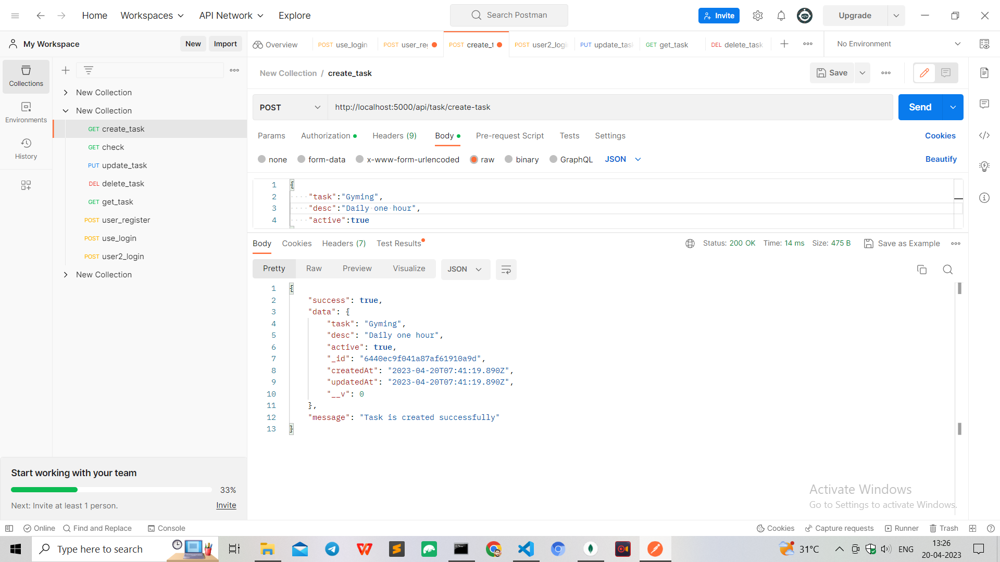
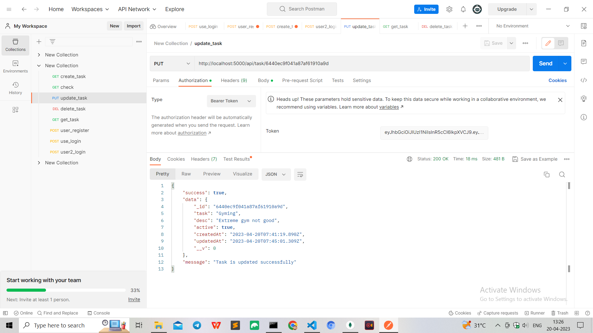
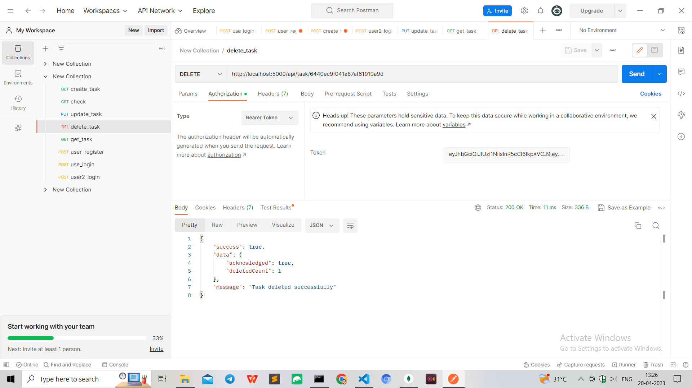

## ToDoList App Using RESTful  API
### Description: Build a RESTful api for a TODO App using Node.js and implementing JWT(jsonwebtoken) authentication.This api would allow us to do create read update delete operations as well as authentication and manage their task using JWT
## Prerequisites
    1.Node.js
    2.Git
## Tech Used
    1.mongoose
    2.jwt
    3.express
    4.bcrypt
    4.nodemon
### install the npm first
`npm install`
### start the server
`nodemon index.js`
### UserRegister:When user hit the register endpoint Bearer Token will be generated

### UserLogin:When user hit the login endpoint i am returning the token which generated from the register endpoint

### CreateTask:When user creates a task i am setting the authentication as Bearer token which generated from the register endpoint to see whether user is authenticated or not.

### UpdateTask:When user updates a task i am setting the authentication as Bearer Token which generated from the register endpoint to see whether user is authenticated or not.This route will be updated the task's authentication.

### RetrieveTask: This endpoint will retrieve the task by sending the task identifier

### DeleteTask: This endpoint will be deleted the task by sending the task identifier and also from the database.

### File Structure
|--- .vscode 
|--- config 
|--- |--- middleware 
|--- |--- mongoose 
|--- controllers 
|--- |--- todoController 
|--- |--- userController 
|--- models 
|--- |--- TodoModel 
|--- |--- User 
|--- routes 
|--- |--- todo 
|--- |--- user 
|--- gitignore 
|--- index.js 
|--- package-lock.json 
|--- package.json 
|--- Readme.md 